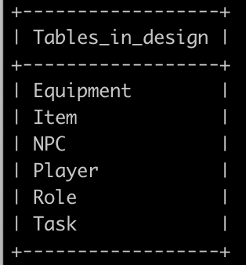
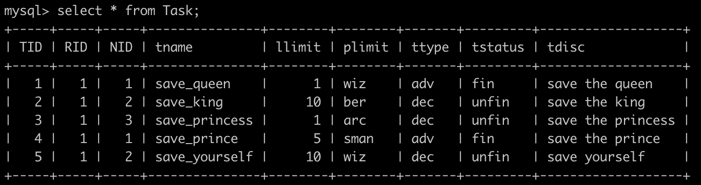
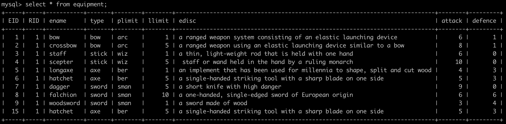
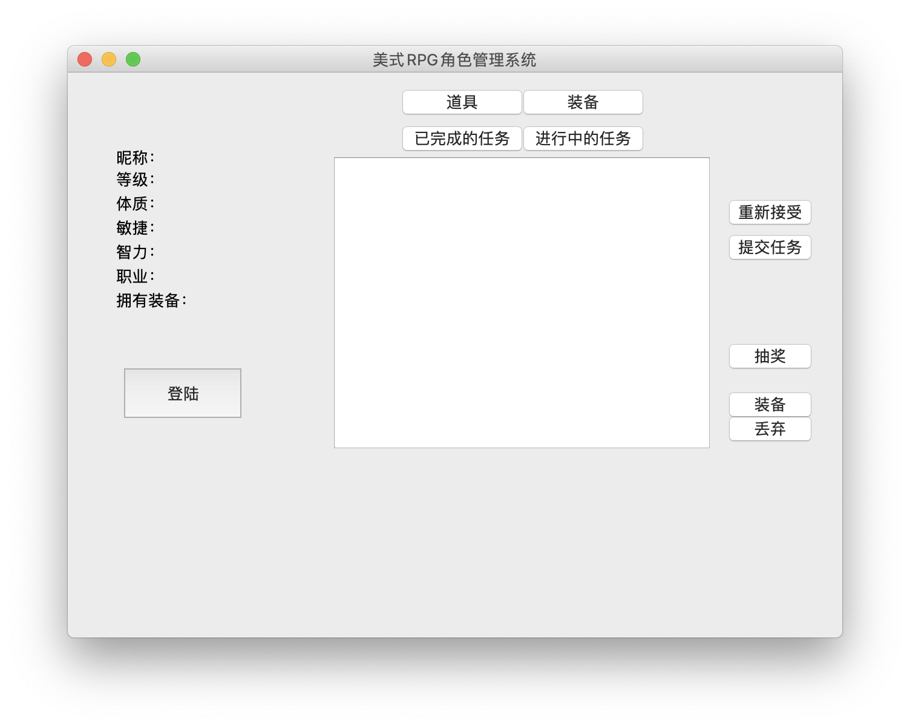
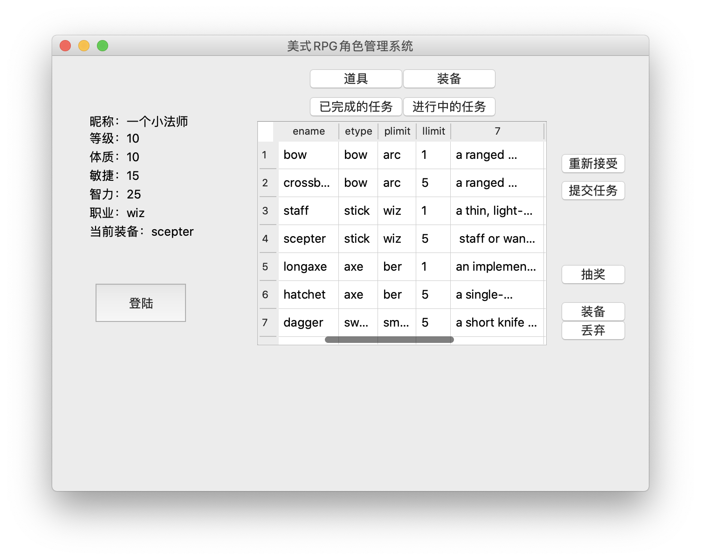

## 简单的RPG角色管理系统 

数据库课程小设计。

大二时候写的所以现在看起来无比青涩。

如果可以帮到正在学习数据库的人就再好不过了。

### 用到的库

pymysql

Pyqt5

### 如何运行

- 前端：gui.py

- 后端：backend.py

- 数据库：design.sql

进入mysql，输入如下命令

```mysql
CREATE DATABASE design;
source ./design.sql
```

然后退出mysql，在控制台中输入

```shell
python3 gui.py
```

Have FUN xD.


### 数据表



由上到下分别是：装备，道具，NPC，角色，职业，任务。





……

### 界面





### 功能

本来打了一大堆功能描述，但其实也就是界面上按钮的字面意思...

抽奖可以随机给个装备。

### tips

玩的时候记得修改backend里mysql的信息，账户密码什么的。